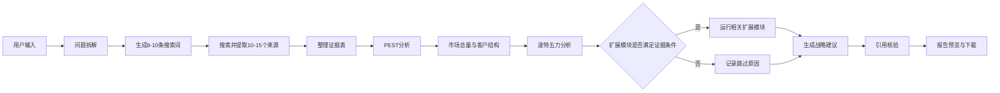

# Enterprise AI Strategy Research Agent - 产品需求文档 V1.0

## 1. 产品概述

### 1.1 产品名称

Enterprise AI Strategy Research Agent

中文名称：企业战略研究助手

### 1.2 一句话定义

用户输入一个行业、地区、研究期间和战略问题，Agent 自动搜索公开资料，使用“PEST + 市场分析 + 波特五力”固定骨架，并按证据选择扩展模块，生成一份带来源、可复核的战略分析报告。

### 1.3 产品目标

本产品解决的不是“不会写报告”，而是战略研究中资料分散、框架不统一、结论缺少来源的问题。

V1.0 只完成一个简单闭环：

```text
输入战略问题
  -> 搜索公开资料
  -> 整理证据
  -> PEST分析
  -> 市场总量与客户结构分析
  -> 波特五力分析
  -> 按需启用扩展模块
  -> 生成战略建议
  -> 核验引用
  -> 导出Markdown报告
```

### 1.4 默认展示案例

| 项目 | 默认值 |
|---|---|
| 行业 | 企业级 AI Agent |
| 地区 | 中国 |
| 研究期间 | 2024-2026 |
| 研究对象 | 火山引擎，可留空 |
| 战略问题 | 火山引擎应优先服务哪些客户群，并形成怎样的差异化？ |

### 1.5 项目定位

该项目是一款轻量战略研究工具，同时是一份面向互联网战略、商业分析和企业服务战略岗位的个人作品。

项目重点展示：

1. 将模糊业务问题拆成结构化分析框架；
2. 运用 PEST、市场分析和波特五力完成企业战略分析；
3. 使用 Agent 调用搜索工具和大模型；
4. 对事实、判断和建议进行区分；
5. 通过引用检查降低 AI 幻觉风险；
6. 将分析结果产品化为可下载报告。

## 2. 用户与痛点

### 2.1 目标用户

核心用户是需要快速进入陌生行业的初级战略分析人员、商业分析人员和商科学生。

用户具备基本商业分析能力，但不一定会编程，也没有充足时间逐个打开网页、整理来源和搭建报告结构。

### 2.2 用户痛点

1. 信息分散在公司官网、政府网站、研究报告、新闻和行业文章中；
2. 搜索耗时，且容易重复阅读同一条二手信息；
3. 通用 AI 报告结构不稳定，容易遗漏宏观或竞争维度；
4. 报告看似完整，但关键数字和判断无法追溯；
5. 不同来源存在时间、地区和统计口径冲突；
6. 资料不足时，AI 容易用常识补出确定结论。

### 2.3 用户价值

用户不需要获得一份“自动完成的最终决策”，而是获得一份结构清晰、来源可查、能够继续修改的研究底稿。

## 3. V1.0 功能范围

### 3.1 必须实现

| 功能 | 说明 |
|---|---|
| 研究参数输入 | 输入行业、地区、研究期间、研究对象和战略问题 |
| 联网搜索 | 搜索并提取 10-15 个公开来源 |
| 证据整理 | 保存标题、机构、日期、链接、摘录和来源类型 |
| PEST 分析 | 分析政治、经济、社会、技术四类外部因素 |
| 市场分析 | 分析市场总量、增长阶段、客户结构、采购驱动和采购流程 |
| 波特五力分析 | 分析行业内竞争、潜在进入者、替代品、供应商和客户议价能力 |
| 扩展模块选择 | 证据充分时选择集中度、价值链、关键成功要素、生命周期等模块 |
| 客户与竞争分析 | 识别客户分层、需求、主要竞争者和差异化 |
| 战略建议 | 输出目标客户、产品、渠道和验证动作 |
| 引用核验 | 检查关键事实和数字是否有来源 |
| 报告预览 | 在网页中分章节展示研究结果 |
| Markdown下载 | 下载完整战略研究报告 |
| 样例模式 | 无 API Key 时可查看预生成案例 |
| 实时模式 | 用户输入自己的模型和搜索 API Key 后运行研究 |

### 3.2 暂不实现

以下功能不进入 V1.0：

- 多 Agent 并行；
- PDF、Word、Excel 文件上传；
- 用户登录和历史任务；
- 数据库和知识库；
- OCR；
- PDF 或 Word 报告排版；
- 多模型服务商图形化切换；
- 定时监控和自动更新；
- 复杂财务建模；
- 自动生成唯一战略结论；
- 投资建议和证券评级。

## 4. 分析框架

### 4.1 PEST 模型

PEST 用于分析企业无法直接控制、但会影响行业发展的宏观环境。

#### Political：政策与监管

重点问题：

1. 是否存在直接影响行业发展的法律、政策和监管要求？
2. 数据安全、隐私、内容治理和行业准入有哪些约束？
3. 政府支持、采购和产业政策是否创造机会？
4. 国际关系和跨境合规是否影响市场进入？

#### Economic：经济与商业环境

重点问题：

1. 客户预算和付费意愿如何变化？
2. 技术成本、实施成本和人力成本如何变化？
3. 行业增长是否依赖融资、补贴或宏观景气？
4. 企业购买产品后能否形成可量化的收益？

#### Social：社会与组织因素

重点问题：

1. 用户和企业对新技术的接受度如何？
2. 是否存在岗位替代、组织阻力和信任问题？
3. 决策者、使用者和付费者是否为同一群体？
4. 人才结构和工作方式变化是否推动需求？

#### Technological：技术环境

重点问题：

1. 核心技术处于试验、扩张还是成熟阶段？
2. 模型、算力、数据、工具链和系统集成如何演进？
3. 技术门槛是否正在降低并导致产品同质化？
4. 安全性、稳定性和可解释性是否限制规模化应用？

#### PEST 输出格式

| 维度 | 关键信号 | 证据 | 对行业的影响 | 对研究对象的含义 | 置信度 |
|---|---|---|---|---|---|
| Political |  | [S01] | 机会/威胁 |  | 高/中/低 |
| Economic |  | [S02] | 机会/威胁 |  | 高/中/低 |
| Social |  | [S03] | 机会/威胁 |  | 高/中/低 |
| Technological |  | [S04] | 机会/威胁 |  | 高/中/低 |

PEST 不能只罗列新闻。每个因素都必须进一步回答“这对行业和研究对象意味着什么”。

### 4.2 市场分析

市场分析用于回答“市场是否值得进入、增长来自哪里、谁会购买以及如何购买”。V1.0 面向企业服务场景，因此将消费品框架中的“消费者”统一改写为“企业客户/客户群”，将“购买动机与行为”改写为“采购驱动与采购流程”。

#### 4.2.1 市场总量与发展阶段（必选）

回答以下问题：

1. 市场规模、增速和渗透率如何变化？
2. 市场处于导入期、成长期、成熟期还是调整期？
3. 增长来自新增客户、客单价提升、产品扩张还是替代旧方案？
4. 市场增长会带来规模扩张机会，还是加剧价格竞争？

有连续数据时计算同比增速和 CAGR；只有单点预测时，必须注明预测机构、预测区间和统计口径。

#### 4.2.2 产品结构变化（条件模块）

当来源披露细分产品收入、容量或份额时，分析各产品/服务形态的占比和变化，例如 SaaS、私有化部署、模型服务、解决方案与实施服务。识别增长产品、成熟产品和被替代产品。

#### 4.2.3 地区结构变化（条件模块）

当存在可比地区数据时，分析不同国家、区域或城市群的市场规模、增速和份额变化，并解释政策、客户密度、渠道和交付成本差异。

#### 4.2.4 客户群结构变化（必选）

企业客户至少从以下维度中选择两个进行分层：

- 行业；
- 企业规模；
- 数字化或 AI 应用成熟度；
- 使用场景；
- 预算与部署方式。

报告需区分产品使用者、业务负责人、技术评估者、采购决策者和最终付费者，不得把“客户”视为单一角色。

#### 4.2.5 采购驱动与考虑因素（必选）

识别客户选择供应商时最重要的因素及其变化，包括：

- ROI 和降本增效；
- 产品效果与可验证性；
- 安全、合规和私有化能力；
- 系统集成与交付周期；
- 品牌、案例和生态；
- 价格、合同条款和售后服务。

若没有问卷或调研数据，不输出虚构百分比，只给出有证据的优先级判断。

#### 4.2.6 企业采购流程（条件模块）

按照“需求产生 -> 信息搜集 -> 供应商入围 -> PoC/试用 -> 采购决策 -> 部署 -> 续费/扩容”描述关键决策点、阻碍和成功因素。该模块主要用于涉及获客、销售或商业化的问题。

#### 市场分析输出格式

| 模块 | 核心发现 | 定量指标 | 变化原因 | 战略含义 | 证据状态 |
|---|---|---|---|---|---|
| 市场总量 |  | 规模/增速/CAGR |  |  | 已验证/待核验 |
| 客户结构 |  | 占比/增速（如有） |  |  | 已验证/待核验 |
| 采购驱动 |  | 排序（如有） |  |  | 已验证/待核验 |
| 条件模块 |  |  |  |  | 启用/跳过 |

### 4.3 行业分析

行业分析以波特五力为必选模块，集中度、价值链、关键成功要素和产品生命周期为条件模块。Agent 只在证据足够且与战略问题有关时启用扩展模块。

#### 4.3.1 波特五力（必选）

| 力量 | 重点判断问题 |
|---|---|
| 现有竞争 | 竞争者数量、集中度、产品差异、价格竞争、增长速度、客户切换成本 |
| 潜在进入者 | 技术、资本、数据、渠道、品牌、合规、规模经济和生态门槛 |
| 替代品 | 人工流程、传统软件、外包、通用模型和客户自研的替代可能 |
| 供应商议价 | 上游模型、芯片、云、数据是否集中，更换成本及成本转移能力 |
| 客户议价 | 大客户采购集中度、比价能力、定制要求、自研能力和效果可量化程度 |

每种力量使用 1-5 分表示竞争压力，1 分为很低，5 分为很高。评分属于分析判断，必须同时显示理由、来源、反例和不确定性；无法判断时标记“未知”，不得为了图表完整而强行打分。

| 力量 | 压力评分 | 判断依据 | 主要证据 | 反例/不确定性 | 战略含义 |
|---|---:|---|---|---|---|
| 现有竞争 | 1-5/未知 |  | [S05] |  |  |
| 潜在进入者 | 1-5/未知 |  | [S06] |  |  |
| 替代品 | 1-5/未知 |  | [S07] |  |  |
| 供应商议价 | 1-5/未知 |  | [S08] |  |  |
| 客户议价 | 1-5/未知 |  | [S09] |  |  |

系统最后输出行业吸引力判断：高、中或低，并说明判断依赖的关键假设。

#### 4.3.2 市场集中度（条件模块）

仅在存在可比市场份额时间序列时启用，优先计算或引用 CR3、CR5、CR10，并判断集中度上升、稳定或下降。可参考以下市场演进视角，但不得机械套用：

| 市场状态 | 可能信号 | 可能的战略方向 |
|---|---|---|
| 分散市场 | 集中度较低、地方或垂直品牌众多 | 区域扩张、渠道建设、标准化复制 |
| 块状同质化市场 | 头部集中度快速上升、规模竞争增强 | 加大市场投入、扩大销售与交付能力 |
| 团状异质化市场 | 头部格局分化、细分市场和特色产品增加 | 客户细分、差异化产品和专业化经营 |

#### 4.3.3 价值链与战略控制点（条件模块）

拆解上游基础能力、产品开发、集成实施、渠道销售和售后运营等环节。若有数据，比较各环节的收入、毛利率或议价能力，识别利润池与战略控制点，并判断研究对象应当自建、合作、联盟还是退出某一环节。

#### 4.3.4 关键成功要素（条件模块）

根据竞争证据识别 3-6 个关键成功要素，例如技术效果、产品化、行业知识、销售渠道、交付能力、品牌信任、资金和生态合作。可采用 0-2 分矩阵比较研究对象与主要竞争者：0 分不重要或不具备，1 分中等，2 分重要或明显具备。所有分数均需有依据，不能把评分表当作事实。

#### 4.3.5 产品生命周期（条件模块）

依据市场接受度、客户数量、收入增速、价格变化和竞争者进入情况，判断主要产品处于导入、成长、成熟或衰退阶段，并给出相应策略：

- 导入期：验证需求，控制试错成本；
- 成长期：扩大市场投入和渠道覆盖；
- 成熟期：巩固份额，优化效率与差异化；
- 衰退期：收缩投入、迁移客户或更新产品。

#### 4.3.6 创新与价格-份额（条件模块）

当存在新品发布、价格和市场份额的可比数据时，分析创新节奏、价格带变化及价格与份额的关系。数据不足时只列为待核验项，不推断因果关系。

### 4.4 模块选择规则

Agent 先根据战略问题选择模块，再检查证据是否满足最低要求：

| 模块 | 是否必选 | 启用条件 |
|---|---|---|
| PEST | 是 | 所有任务 |
| 市场总量与客户结构 | 是 | 所有任务；缺数据时明确未知 |
| 波特五力 | 是 | 所有任务 |
| 产品/地区结构 | 否 | 有连续、同口径的细分数据 |
| 采购流程 | 否 | 问题涉及获客、销售或商业化 |
| 集中度 | 否 | 有至少两个时期的可比市场份额 |
| 价值链 | 否 | 有环节、成本、毛利或议价证据 |
| 关键成功要素 | 否 | 有主要竞争者和能力对比证据 |
| 生命周期 | 否 | 有市场接受度、增速或竞争演进证据 |
| 创新与价格-份额 | 否 | 有可比新品、价格和份额数据 |

报告开头必须列出“已启用模块”和“跳过模块及原因”。跳过不是失败，而是防止 Agent 用常识填补数据缺口。

### 4.5 从分析到战略建议

最终建议必须回到用户的战略问题，并回答：

1. 应优先进入哪些市场、地区或客户群？
2. 应提供什么产品组合和价值主张？
3. 应依靠直销、渠道、生态还是合作伙伴触达客户？
4. 研究对象应控制价值链中的哪些关键环节？
5. 未来 90 天应验证哪些关键假设？

## 5. 信息来源与证据规则

### 5.1 来源优先级

来源只分为三类，不做复杂自动评级系统。

| 类型 | 典型来源 | 用途 |
|---|---|---|
| 原始来源 | 政府、监管、公司官网、官方产品文档、正式披露 | 确认事实和产品能力 |
| 专业来源 | 行业协会、研究机构、券商、咨询、学术研究 | 解释市场和行业变化 |
| 线索来源 | 新闻转载、社区、搜索摘要、营销文章 | 寻找线索和反例 |

### 5.2 使用规则

1. 关键数字和事实必须有来源编号；
2. 搜索摘要不能直接作为关键事实来源；
3. 线索来源不能单独支撑核心结论；
4. 找不到原始来源时标记“待核验”；
5. 不同来源发生冲突时并列展示；
6. 必须记录来源标题、机构、日期、链接和相关摘录；
7. 战略建议必须标记为“分析建议”，不能伪装成事实。

### 5.3 来源记录格式

```json
{
  "source_id": "S01",
  "title": "来源标题",
  "publisher": "发布机构",
  "published_at": "2026-01-01",
  "url": "https://example.com",
  "source_type": "primary",
  "excerpt": "与结论相关的原文摘录",
  "used_in": ["PEST-P", "FiveForces-Buyer"]
}
```

## 6. Agent 工作流程

V1.0 使用一个主 Agent 和若干固定工具，不做多 Agent 并行。



### 6.1 问题拆解

Agent 将用户问题拆成：

- 宏观环境问题；
- 市场总量、增速和发展阶段问题；
- 产品、地区和客户结构问题；
- 行业结构问题；
- 客户采购驱动与采购流程问题；
- 竞争与差异化问题；
- 战略选择问题。

### 6.2 搜索

- 生成 8-10 条中文或英文搜索词；
- 调用 Tavily 搜索；
- 最多保留 15 个来源；
- 优先保留官方和专业来源；
- 对 URL 去重；
- 无法提取正文的结果不用于关键结论。

### 6.3 分析

大模型只接收整理后的证据和分析问题，不直接读取无限量网页。

分析按照以下顺序执行：

1. PEST；
2. 市场总量与客户结构；
3. 波特五力；
4. 检查扩展模块的证据条件；
5. 运行符合条件的扩展模块；
6. 战略建议；
7. 风险与未知项。

单个主 Agent 负责模块选择和整合，不新增多个子 Agent。模块选择结果使用结构化字段保存，例如 `enabled_modules`、`skipped_modules` 和 `skip_reason`。

### 6.4 核验

程序自动检查：

- 关键事实是否包含 `[Sxx]`；
- 来源编号是否存在；
- 五力评分是否有文字理由；
- PEST 每个因素是否包含战略含义；
- 市场规模、增速和份额是否注明时间、地区、单位与口径；
- 扩展模块是否满足启用条件，跳过模块是否说明原因；
- 报告是否保留风险和未知项；
- 下载文件是否包含 API Key。

## 7. 页面设计

### 7.1 输入区

```text
行业：[企业级 AI Agent]
地区：[中国]
研究期间：[2024] 至 [2026]
研究对象（选填）：[火山引擎]
战略问题：[应优先服务哪些客户，并形成怎样的差异化？]

[开始研究]
```

### 7.2 配置区

侧边栏仅包含：

- 样例模式 / 实时模式；
- 模型 API Key；
- Tavily API Key；
- 数据和隐私提示。

模型服务商和模型名称在 V1.0 中使用配置文件设置，不在页面提供复杂选择。

### 7.3 进度区

显示以下五个步骤：

1. 拆解问题；
2. 搜索资料；
3. 分析框架；
4. 核验引用；
5. 生成报告。

### 7.4 结果区

使用五个标签页：

1. 核心结论；
2. 宏观与市场；
3. 行业结构；
4. 战略建议；
5. 来源与未知项。

“行业结构”标签页先展示波特五力，再展示本次实际启用的扩展模块。页面不展示空白模块。

## 8. 最终报告

### 8.1 报告长度

目标长度为 2,500-4,000 个中文字，约 5-8 页普通文档。未启用扩展模块时保持在下限附近。

### 8.2 报告文件

文件格式：Markdown

文件名：

```text
strategy_report_{industry}_{YYYYMMDD_HHMMSS}.md
```

### 8.3 报告结构

```markdown
# 行业战略研究报告

## 1. 研究范围
- 行业：
- 地区：
- 时间：
- 研究对象：
- 核心问题：
- 已启用模块：
- 跳过模块及原因：

## 2. 核心结论
1. 三条最重要发现
2. 行业吸引力判断
3. 优先客户与差异化方向

## 3. 宏观环境分析（PEST）
### Political
### Economic
### Social
### Technological

## 4. 市场分析
### 市场总量、增速与发展阶段
### 产品/地区结构（条件模块）
### 客户群结构
### 采购驱动与采购流程

## 5. 行业结构分析
### 波特五力
### 现有竞争
### 潜在进入者
### 替代品
### 供应商议价能力
### 客户议价能力
### 集中度（条件模块）
### 价值链与战略控制点（条件模块）
### 关键成功要素（条件模块）
### 产品生命周期（条件模块）
### 创新与价格-份额（条件模块）

## 6. 客户与竞争
- 客户分层与决策角色
- 采购驱动与障碍
- 竞争者比较
- 可形成的差异化

## 7. 战略建议
- 优先客户
- 产品策略
- 渠道策略
- 价值链选择
- 90天验证动作

## 8. 风险与未知项
- 缺失数据
- 冲突来源
- 可能推翻建议的假设

## 9. 资料来源
[S01] 来源标题、机构、日期、链接
```

### 8.4 报告示意

报告不是只输出“政策利好”或“竞争激烈”这类空泛描述，而应形成完整推理：

```text
证据：某项政策或客户变化。[S01]
判断：它提高或降低了哪一种行业力量。
含义：它对哪些客户和产品策略产生影响。
建议：研究对象下一步应验证或采取什么行动。
```

## 9. Token 与成本

### 9.1 单次运行目标

完整研究预计消耗 20,000-40,000 tokens。只有在启用多个扩展模块时才接近上限。

建议分配：

| 阶段 | Token范围 |
|---|---:|
| 问题拆解和搜索词 | 2,000-4,000 |
| 证据整理 | 3,000-6,000 |
| PEST、市场和五力分析 | 8,000-15,000 |
| 扩展模块、竞争和建议 | 5,000-10,000 |
| 核验与报告 | 4,000-8,000 |

### 9.2 控制方式

1. 最多保留 15 个来源；
2. 每个来源只传入相关摘录；
3. 报告限制为 2,500-4,000 字；
4. 达到预算后停止补充搜索；
5. 样例模式不调用外部模型；
6. 公网实时模式由用户提供 API Key。

## 10. 异常处理

| 异常 | 处理方式 |
|---|---|
| 行业或问题为空 | 阻止提交并提示补充 |
| 时间范围错误 | 阻止提交 |
| API Key缺失 | 实时模式禁止运行，样例模式不受影响 |
| 搜索无结果 | 修改搜索词重试一次 |
| API超时 | 最多重试两次 |
| 部分网页无法提取 | 跳过并记录 |
| 模型输出格式错误 | 自动修复一次 |
| 来源不足 | 输出“证据不足”，不补造结论 |
| 某项五力无法判断 | 保留未知，不强行评分 |
| 扩展模块数据不足 | 跳过模块并记录原因，不生成空表 |

## 11. 安全与隐私

1. API Key 只保存在当前会话；
2. Key 不进入源码、日志和报告；
3. 公开 GitHub 仓库不包含真实 Key；
4. 公网应用不内置作者 Key；
5. V1.0 不上传本地文件，降低数据隐私风险；
6. 报告明确声明输出不构成投资或经营决策。

## 12. 验收标准

### 12.1 基础功能

1. 用户可以输入行业、地区、时间、对象和战略问题；
2. 样例模式无需 Key 即可查看完整报告；
3. 实时模式可以完成搜索、分析、核验和报告生成；
4. 页面可以显示运行进度；
5. 报告可以下载为 Markdown。

### 12.2 分析框架

1. PEST 四个维度均有内容；
2. 每个 PEST 维度至少包含一个证据和一个战略含义；
3. 报告包含市场总量、发展阶段、客户群结构和采购驱动，缺少数据时明确标记未知；
4. 波特五力五个维度均给出压力判断或明确标记未知；
5. 每项五力评分均有理由，不允许只有分数；
6. 报告列出已启用模块、跳过模块及原因；
7. 集中度、价值链、关键成功要素和生命周期仅在满足证据条件时出现；
8. 报告包含客户分层和竞争者比较；
9. 战略建议包含目标客户、产品/渠道方向、价值链选择和验证动作。

### 12.3 证据质量

1. 所有关键事实和数字均带 `[Sxx]`；
2. 报告引用编号均能在来源部分找到；
3. 搜索摘要不能直接作为核心结论来源；
4. 冲突来源和证据缺口不会被隐藏；
5. 无来源的内容被标记为分析判断或未知；
6. 报告和日志不包含 API Key。

### 12.4 展示与发布

1. 公开 GitHub 仓库包含 README、PRD、流程图、原型图、样例报告和 Demo 链接；
2. 公开仓库不包含源码；
3. 私有源码仓库部署公开 Streamlit Demo；
4. README 提供 3 分钟以内演示视频或 GIF；
5. 发布 v0.1.0 Release，包含样例报告。

## 13. 开发工作量

预计开发时间为 14-20 小时：

| 阶段 | 时间 |
|---|---:|
| PRD、流程和输出模板 | 2-3小时 |
| 搜索与证据整理 | 3-4小时 |
| PEST、市场、五力和模块选择提示词 | 4-5小时 |
| 引用核验 | 2小时 |
| Streamlit界面 | 2-3小时 |
| 测试、样例和部署 | 2-3小时 |

## 14. 发布物

### 14.1 公开仓库

建议仓库名称：`enterprise-ai-strategy-agent`

包含：

- 中英文 README；
- 本 PRD；
- 产品流程图；
- 页面原型图；
- 默认案例报告；
- Demo 链接；
- 演示 GIF 或视频。

### 14.2 私有源码仓库

建议仓库名称：`enterprise-ai-strategy-agent-app`

包含：

- Streamlit应用；
- 搜索工具；
- Agent提示词和分析流程；
- 引用核验；
- 测试和部署配置。

## 15. 后续迭代

完成 V1.0 并验证报告质量后，再考虑：

- PDF上传；
- 多 Agent 并行；
- 更多战略框架；
- Word/PDF导出；
- 历史任务；
- 行业模板；
- 竞争动态监控。

V1.0 不提前实现以上功能。

## 16. 免责声明

本产品输出为基于公开资料生成的战略研究底稿，不构成投资建议、法律意见或最终经营决策。用户应打开原始来源核对关键事实，并结合客户访谈、内部数据和实际业务约束独立判断。
