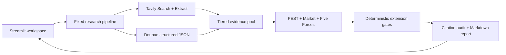

# Enterprise AI Strategy Research Agent

[简体中文](README.zh-CN.md) | English

[Live Demo](https://xiaowbai-strategy-agent.streamlit.app) | [v0.1.0 Release](https://github.com/enachepaolae172-web/xiaowbai/releases/tag/v0.1.0)

An evidence-first strategy research workspace that turns a business question into a citable, reviewable Markdown report. It combines public-source retrieval, PEST, market analysis, Porter's Five Forces, evidence-gated extension modules, and a 30/60/90-day validation plan.


## Why This Project

Strategy research is rarely blocked by a lack of frameworks. The harder problem is keeping fragmented sources, statistical scopes, analytical judgments, and recommendations traceable. This project treats evidence as a first-class product object:

- full-text sources may support facts; search snippets may only provide leads;
- facts, judgments, counterpoints, unknowns, and recommendations stay separate;
- every report claim uses a stable `[Sxx]` source identifier;
- optional modules run only when deterministic evidence thresholds are met;
- missing evidence remains visible instead of being filled with plausible prose.

## Product Experience

**Sample mode** opens a pre-generated Volcengine enterprise AI Agent case without API calls. **Real-time mode** accepts the visitor's Doubao and Tavily keys for the current session and runs the complete workflow.

The result workspace contains five views:

1. Core conclusions and research questions
2. PEST, market, customer, and procurement analysis
3. Porter's Five Forces and enabled extension modules
4. Target customer, product, channel, value-chain, and 90-day recommendations
5. Sources, skipped modules, missing evidence, unknowns, and full Markdown

## Architecture



The application uses plain Python orchestration with Pydantic contracts. It does not use LangChain, a vector database, a database, or a multi-agent framework. See [Architecture and workflow](docs/architecture.md) for the full design.

## Quick Start

Requirements: Python 3.12.

```powershell
git clone https://github.com/enachepaolae172-web/xiaowbai.git
cd enterprise-ai-strategy-agent
py -3.12 -m venv .venv
.venv\Scripts\Activate.ps1
python -m pip install --upgrade pip
python -m pip install -r requirements.txt
streamlit run app.py
```

Open `http://localhost:8501`. Sample mode is immediately available. Real-time mode requires:

- a Volcengine Ark API key with access to the configured Doubao model;
- a Tavily API key.

Keys entered in the UI are not written to reports, logs, or project files.

## Tests

```powershell
python -m pytest
python -m scripts.build_sample_report
```

The test suite covers input validation, source normalization, evidence extraction, model JSON repair, PEST and Five Forces contracts, optional-module gates, citation checks, sample and real-time pipeline behavior, UTF-8 Markdown output, and Streamlit UI states.

## Repository Map

| Path | Purpose |
|---|---|
| `app.py` | Streamlit interface and report views |
| `src/pipeline.py` | Fixed end-to-end research orchestration |
| `src/search.py` | Tavily adapter, URL normalization, and diagnostics |
| `src/evidence.py` | Source classification and evidence-pool construction |
| `src/strategy_analysis.py` | Mandatory PEST, market, and Five Forces validation |
| `src/conditional_analysis.py` | Deterministic optional-module eligibility gates |
| `src/reporting.py` | Markdown renderer and `[Sxx]` citation audit |
| `data/sample/` | Offline fixtures and the pre-generated case report |
| `tests/` | Unit, workflow, UI, and safety tests |

## Boundaries

- The output is a research draft, not investment or management advice.
- Public sources may be incomplete, stale, or based on incompatible definitions.
- The model does not bypass paywalls or access private databases.
- V0.1 does not include accounts, a database, task history, file upload, PDF/Word export, or scheduled monitoring.
- Human review remains required before using a recommendation.

## Security

Real secrets are excluded by `.gitignore`; the repository history is scanned before release. The public demo never ships an author-owned API key. See [Security policy](SECURITY.md).

## Documentation

- [Chinese README](README.zh-CN.md)
- [Product requirements](PRD.md)
- [Architecture and workflow](docs/architecture.md)
- [Public deployment](docs/deployment.md)
- [Sample report](data/sample/strategy_report.md)
- [Changelog](CHANGELOG.md)

## License

[MIT](LICENSE)
