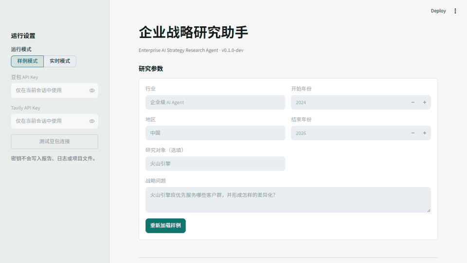
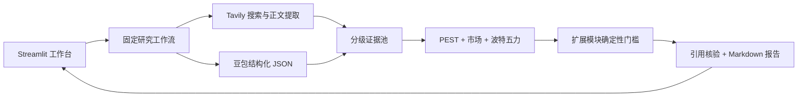

# 企业战略研究助手

简体中文 | [English](README.md)

[在线演示](https://xiaowbai-strategy-agent.streamlit.app) | [v0.1.0 正式版本](https://github.com/enachepaolae172-web/xiaowbai/releases/tag/v0.1.0)

一个证据优先的战略研究工作台：用户输入行业、地区、研究期间和战略问题后，系统搜索公开资料，运行 PEST、市场分析和波特五力，并按证据决定是否启用扩展模块，最终生成带 `[Sxx]` 引用、可复核的 Markdown 研究底稿。



## 项目解决什么问题

战略研究真正耗时的部分通常不是套用框架，而是整理分散资料、统一统计口径，并区分哪些是事实、哪些是分析判断。项目因此把“证据”作为核心数据对象：

- 网页正文可以支撑事实，搜索摘要只能作为线索；
- 事实、判断、反例、未知项和建议分别保存；
- 报告结论通过稳定的 `[Sxx]` 编号追溯来源；
- 扩展模块必须通过确定性的最低证据门槛；
- 数据不足时明确跳过，不用常识补出确定结论。

## 使用方式

**样例模式**无需 API Key，打开后直接浏览火山引擎企业级 AI Agent 预生成案例。**实时模式**在当前会话中输入自己的豆包与 Tavily Key，执行完整研究流程。

结果工作台分为五个页面：

1. 核心结论与研究问题
2. PEST、市场、客户和采购分析
3. 波特五力与实际启用的扩展模块
4. 目标客户、产品、渠道、价值链与 90 天验证计划
5. 来源、跳过模块、缺失证据、未知项和完整 Markdown

## 技术架构



项目使用 Python 与 Pydantic 直接编排，不使用 LangChain、向量数据库、业务数据库或多 Agent 框架。详细设计见[架构与工作流](docs/architecture.md)。

## 本地运行

需要 Python 3.12。

```powershell
git clone <你的仓库地址>
cd enterprise-ai-strategy-agent
py -3.12 -m venv .venv
.venv\Scripts\Activate.ps1
python -m pip install --upgrade pip
python -m pip install -r requirements.txt
streamlit run app.py
```

打开 `http://localhost:8501`。样例模式可直接使用；实时模式需要：

- 已开通对应豆包模型权限的火山方舟 API Key；
- Tavily API Key。

在界面输入的 Key 不会写入报告、日志或项目文件。

## 测试

```powershell
python -m pytest
python -m scripts.build_sample_report
```

测试覆盖输入校验、URL 去重、证据抽取、模型 JSON 修复、PEST 与五力结构、扩展模块门槛、引用核验、样例/实时工作流、中文 Markdown 编码和 Streamlit 页面状态。

## 目录说明

| 路径 | 用途 |
|---|---|
| `app.py` | Streamlit 界面与报告展示 |
| `src/pipeline.py` | 固定端到端研究工作流 |
| `src/search.py` | Tavily 接口、URL 规范化与诊断 |
| `src/evidence.py` | 来源分级与证据池 |
| `src/strategy_analysis.py` | PEST、市场与波特五力校验 |
| `src/conditional_analysis.py` | 扩展模块确定性启用规则 |
| `src/reporting.py` | Markdown 生成与 `[Sxx]` 引用核验 |
| `data/sample/` | 离线样例与预生成报告 |
| `tests/` | 单元、工作流、界面和安全测试 |

## 使用边界

- 输出是研究底稿，不构成投资或经营建议。
- 公开资料可能不完整、过期或统计口径不一致。
- 系统不会绕过付费墙，也不会访问私人数据库。
- V0.1 不包含登录、数据库、历史任务、文件上传、Word/PDF 导出和定时监控。
- 战略建议在实际使用前仍需要人工复核。

## 文档

- [English README](README.md)
- [产品需求文档](PRD.md)
- [架构与工作流](docs/architecture.md)
- [公开部署说明](docs/deployment.md)
- [样例报告](data/sample/strategy_report.md)
- [版本记录](CHANGELOG.md)
- [安全说明](SECURITY.md)

## 开源协议

[MIT](LICENSE)
