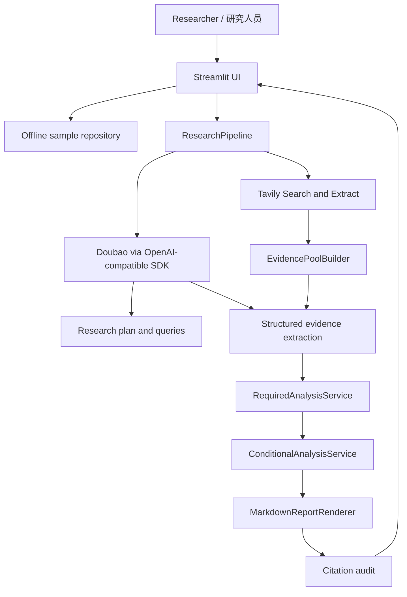
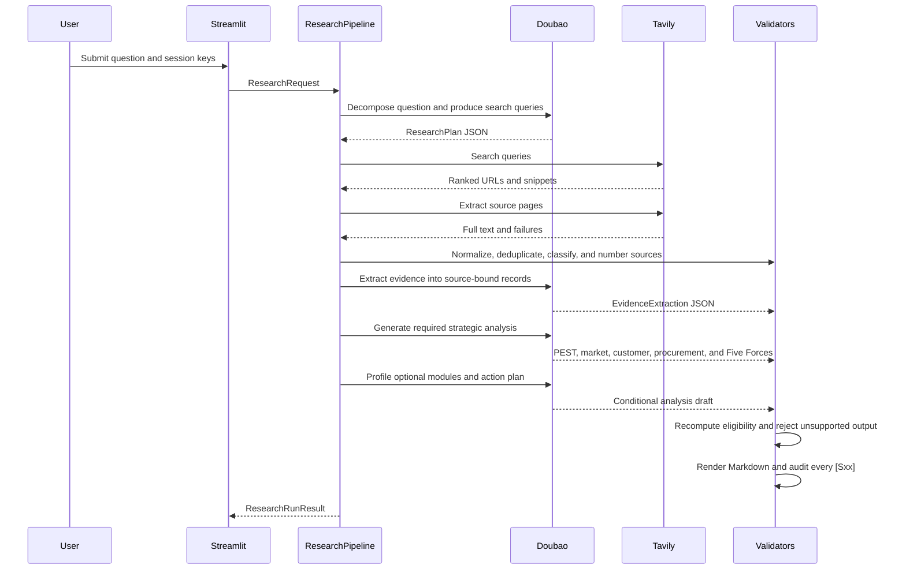

# Architecture and Workflow / 架构与工作流

## System Context / 系统边界

The UI never owns research logic. `ResearchPipeline` coordinates explicit service interfaces, while Pydantic models define every intermediate contract. This keeps API adapters replaceable and makes paid calls unnecessary in tests.

界面不承载研究逻辑。`ResearchPipeline` 只编排显式服务接口，中间结果全部由 Pydantic 模型约束，因此搜索或模型接口可以替换，自动化测试也不需要付费调用。

## Real-time Sequence / 实时模式时序

## Evidence Rules / 证据规则

| Rule | Enforcement |
|---|---|
| Stable source identifiers | Evidence pool assigns `[S01]` through `[S15]` after URL normalization and deduplication. |
| Search snippets are leads | A `SEARCH_SNIPPET` cannot become a fact or support an action recommendation. |
| Facts require a source | Evidence-backed findings cannot contain facts without known `evidence_ids`. |
| Unknown remains unknown | Unsupported findings must state unknowns and use unknown confidence/impact where applicable. |
| Optional modules are deterministic | Code recomputes minimum thresholds for concentration, value chain, key success factors, lifecycle, and innovation-price-share. |
| Citations are closed-loop | Unknown `[Sxx]` references or uncited factual lines fail report verification. |
| Secrets are ephemeral | API keys are accepted by password widgets and never stored in result models or output files. |

## Optional Module Gates / 扩展模块门槛

| Module | Minimum evidence |
|---|---|
| Concentration | At least two comparable periods of market-share data |
| Value chain | At least two stages plus profit-distribution or control-point evidence |
| Key success factors | At least two competitors and two comparable capability dimensions |
| Lifecycle | At least two independent lifecycle signals |
| Innovation and price-share | At least two comparable products plus both price and share evidence |

Ineligible model output is discarded even when the model writes an analysis. Eligible modules without a valid structured output are conservatively skipped.

即使模型生成了扩展分析，只要代码复算后不满足门槛，该输出也会被丢弃；满足门槛但缺少有效结构化结果时同样保守跳过。

## Failure Behavior / 异常处理

- Empty or invalid inputs are rejected before any external call.
- Missing keys disable real-time submission.
- Search timeouts, no-result responses, extraction failures, invalid model keys, rate limits, and malformed JSON produce user-facing errors instead of a broken page.
- The model gets one bounded JSON-repair attempt.
- A report is withheld when citation verification fails.
- Sample mode is fully available when external services are unavailable.

## Deployment / 部署

The public Streamlit deployment contains no project-owned API key. Visitors can inspect sample mode without logging in and may optionally provide their own session keys for real-time research.

公开 Streamlit 部署不保存项目作者的 API Key。访问者无需登录即可查看样例，也可以选择在当前会话中输入自己的 Key 运行实时研究。
